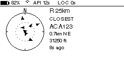
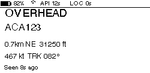
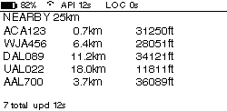
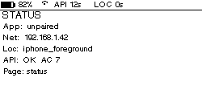
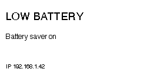
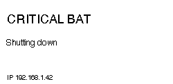

# Display layouts

The ePaper is 250×122 (Waveshare 2.13" Rev2.1), 1-bit. Every page
shares a top status bar and a bottom error/status row. Layouts are
defined in
[`apps/pi/flightpaper/display/layouts.py`](../apps/pi/flightpaper/display/layouts.py)
and rendered through
[`apps/pi/flightpaper/display/renderer.py`](../apps/pi/flightpaper/display/renderer.py).

All previews below are regenerated with:

```bash
python apps/pi/scripts/render_preview.py --all \
  --output-dir docs/img
```

The tool runs anywhere (no SPI hardware needed) and writes a 1-bit
PNG that matches what the ePaper will show.

## Boot


Shows on first power-up while the package wires up state. Used as a
defensive "we're alive" frame so the screen isn't empty between power
and pair.

## Pairing


Rendered while in `pairing_pending`. The QR encodes
`flightpaper://pair?p=<base64url(json)>` (see [pairing.md](pairing.md)).
The right side shows the manual fallback: IP, 6-digit code, and a
countdown to QR expiry.

## Radar



Concentric rings around "you". Distance scales linearly to the
configured `ui.radius_km`. Each aircraft is a small triangle rotated
by `true_track_deg`. Aircraft are not labelled in-radar (the labels
would overlap each other and the right-side panel); the closest
aircraft's metadata renders in the right panel.

The companion app mirrors this page in
[`apps/mobile/src/screens/RadarScreen.tsx`](../apps/mobile/src/screens/RadarScreen.tsx).

## Closest



Single aircraft, the closest in range, with full readout: callsign,
altitude, speed, distance, bearing, origin country. Auto-cycles to
the radar page after a configurable dwell time.

## List



Five-row table of the nearest aircraft. Six rows previously overlapped
the bottom status row; five gives breathing room. Sort is closest-
first; pages cycle via the `display.default_page` PiSugar button or
the companion app's **Display page** picker.

## Status



What the device is actually doing right now: ID, uptime, Wi-Fi SSID,
IP, battery, location source + age, OpenSky status + rate-limit
remaining, last refresh age. Useful both for the user and as the
"phone home" view in the companion app's Device Status screen.

## Shutdown confirmation


Renders when a very-long PiSugar button press is detected, before the
service actually issues `systemctl poweroff`. Gives a few seconds to
release the button to abort.

## Error / recovery pages

Eight error variants, each rendered when the corresponding subsystem
reports a fault. The page is full-screen because errors trump
everything else.

| File | Trigger |
|---|---|
|  | `network.wifi_ssid is None` |
|  | `network.internet_ok = false` |
|  | Pair record dropped after a request — fall through to a re-pair prompt |
|  | `location.state in {none, expired}` |
|  | OpenSky 5xx or hard failure |
|  | OpenSky 429 backoff in progress |
|  | `battery.percent <= battery.low_percent` and not charging |
|  | `battery.percent <= battery.critical_percent` and not charging |

The Pi keeps trying to recover. The error page persists until the
underlying status block returns to normal.

## Global status bar

Every non-error page carries:

- Left:  device name + page name
- Right: location-age glyph, OpenSky status glyph, battery glyph

The glyphs are drawn from Pillow primitives in
[`apps/pi/flightpaper/display/symbols.py`](../apps/pi/flightpaper/display/symbols.py),
not from a font, so they look crisp on the 1-bit raster.

## Refresh strategy

ePaper refreshes are expensive: a full refresh flashes the screen and
takes ~2 s; a partial refresh updates a sub-region in ~300 ms but
accumulates ghosting after many cycles.

Configuration:

```yaml
display:
  partial_refresh: true
  full_refresh_every: 20   # one full refresh per N partial refreshes
```

If you see ghosting, raise `full_refresh_every` (more frequent flushes)
or set `partial_refresh: false`.
